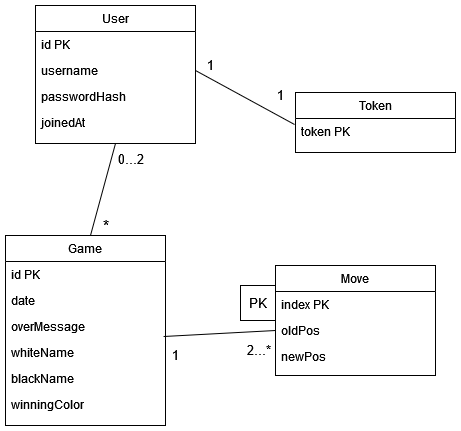

# Database model

The database consists of the following tables:

## User

Stores the credentials of a logged in user.

## Token

Stores user session's refresh tokens.

## Game

Games are assigned to 0-2 users, depending on whether the players are guests or logged in users. winnerMessage contains the reason for the game ending, for example "checkmate" or "resignation". whiteName and blackName are not foreign keys, since guest usernames are not stored in the database.

## Move

Moves are assigned to a game. Index refers to how many moves were played in the game before this move.