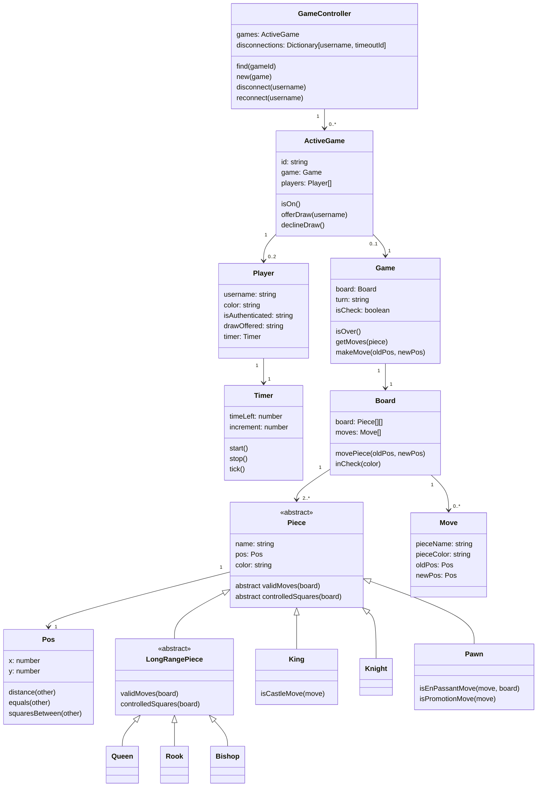

# Game Model

The chess game logic is implemented with an object oriented approach. Here is the class structure with the most important propetries and methods:

## GameController

GameController is used as a singleton object. It has a list of all the active games, and a dictionary of the users that have disconnected. When a user disconnects, a timeout is started. If the user does not reconnect, the game is ended and the disconnected player loses.

## ActiveGame

ActiveGame is a wrapper class for a Game object. It contains the game id, the game object, and the players. It is initialized when a player creates a new game, and is removed when the game is over.

## Game

Game is the main class that stores the chess game's state i.e. the board, which player's turn it is, and if the game is over. It has methods to get the possible moves for a piece, and to make a move. Game does not have a reference to the players, it only knows which color has the next turn.

## Player

Player is assigned to ActiveGame. It represents a logged in user or a guest that is playing a game. It contains the username, the color of the player, and a Timer object.

## Timer

Timer is used to keep track of the time left for each player. It has an increment and a timeLeft property that is updated every second.

## Board

Board has a 2D array of Pieces, which are located in the array according to where they are in the chess board. It has a list of all the moves that have been made, and a method to move a piece. Board is assigned to Game.

## Move

Move is an object that stores the information about a move. It contains the name of the piece that was moved, the color of the piece, the old position, and the new position.

## Piece

Pieces are stored in the Board array. They are aware of their position, their color and what kind of pieces they are e.g. pawn, knight. They have methods to get the valid moves and the controlled squares. The valid moves are the squares that the piece can move to, and the controlled squares are the squares that the piece can attack. Piece is an abstract class that is extended by all the different types of pieces.

## LongRangePiece

LongRangePiece is an abstract class that is extended by pieces that can move in a straight line. Rook, Queen and Bishop are LongRangePieces. These pieces behave in a similar way, so they share the same logic for calculating the valid moves and the controlled squares.

## Pos

Pos represents a location in the chess board. It has an x and a y coordinate, and it has lots of utility methods, such as returning the distance or the squares between two positions.